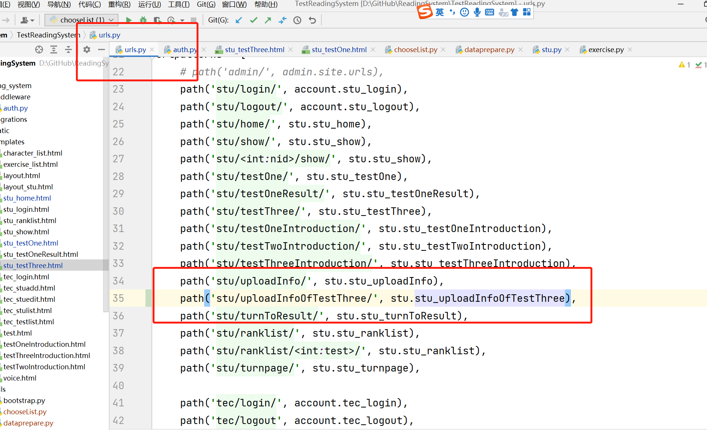

# 主要是在 stu_testThree.html 这个html文件里，<script>部分就是编写js代码的部分，里面的函数我备注了功能，都是基础的，一些是计时的模块，获取当前距离测试开始过了多长时间等。

# 这个用ajax传输数据和vue里面的相差不大，主要是传输当前这道题的答题情况，正确错误，这里面的url与函数一一对应

# 在url里面配置路由，path('路由',对应的处理函数)，ajax向哪个路由传输数据，就调用对应的函数进行处理。

# 对应的函数定义，通过request.POST获取传输的post参数，然后进行处理

# 预期实现的效果在《阅读测试的程序建构里》里，只要实现一个其他的都类似。目前的难点在于怎么录下使用者的音频，然后进行识别判断结果，并把它记录下来，最后计算得到最终成绩，而且是用户每答完一次题，就要语音识别一次，然后把结果记录下来，并且更新题目，目前主要考虑录音和语音识别的问题

# 测试的材料无所谓，先实现录音识别的功能，可能用到的学生账号登录如下图，可以在数据库加入或者自己造一下。

# 数据库的环境配置要改下

